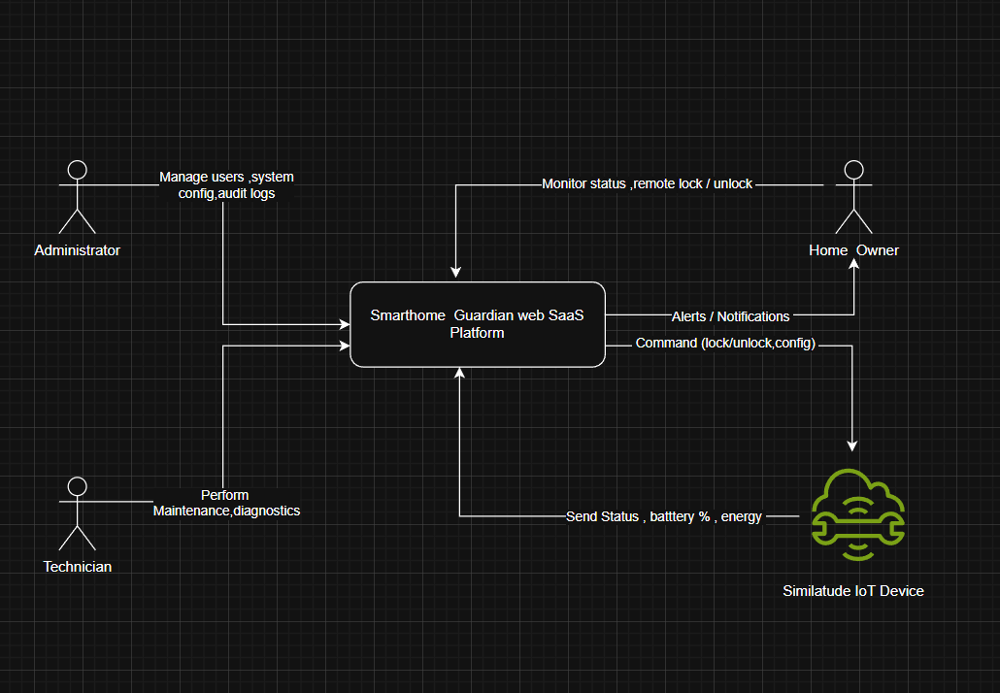

# SmartHome Guardian – System Scope Definition
# Context Diagram

## 1. Overview

The system scope defines the boundaries of the SmartHome Guardian platform — what the system will do, what it will not do, and the limits within which it operates.

This ensures:
- Controlled system complexity
- Alignment with project goals
- Feasibility within the  timeline

---

## 2. System Type

SmartHome Guardian is a:

- Web-based SaaS platform
- Focused on smart home monitoring and predictive alerts
- Designed for battery-powered IoT devices

---

## 3. In-Scope Features (INCLUDED)

### 3.1 Device Management
- Register smart devices:
  - Smart Lock (battery-powered)
  - Motion/Door Sensor (battery-powered)
  - Smart Plug (reference device)
- View device list and status

---

### 3.2 Real-Time Monitoring (Simulated)
- Display:
  - Battery level
  - Device status (active, offline)
  - Event activity (motion detected, door opened)

---

### 3.3 Remote Device Control
- Lock/Unlock smart lock remotely
- Send commands to devices (simulated)

---

### 3.4 Security Alerts
- Detect and notify:
  - Unauthorized access attempts
  - Suspicious motion events

---

### 3.5 Predictive Battery Alerts (CORE FEATURE)
- Predict battery depletion within 24–72 hours
- Display:
  - Remaining time estimate
  - Confidence level
  - Explanation (black-box output)

Example:
> "Battery low in 48h • Confidence: 85% • Reason: Increased usage pattern"

---

### 3.6 Basic Energy Monitoring
- Track simple usage (smart plug)
- Display daily / weekly summaries

---

### 3.7 User & Role Management
- Roles:
  - Home Owner
  - Administrator
  - Technician
- Role-Based Access Control (RBAC)

---

### 3.8 Audit Logging
- Log key actions:
  - Device commands
  - Alerts generated
  - Access attempts

---

### 3.9 Connectivity Handling
- Detect device offline/online state
- Handle intermittent connectivity gracefully

---

## 4. Out-of-Scope Features (EXCLUDED)

### 4.1 Hardware Integration
- No real hardware communication
- All IoT behavior is simulated

---

### 4.2 Advanced AI/ML Implementation
- No actual machine learning models
- Prediction module is treated as a black box

---

### 4.3 Mobile Applications
- No native mobile apps (iOS/Android)

---

### 4.4 Video Surveillance
- No cameras or video streaming

---

### 4.5 Voice Assistants
- No voice interaction (Alexa, Google Assistant)

---

### 4.6 Payment or Subscription Systems
- No billing or payment integration

---

### 4.7 External Smart Home Ecosystem Integration
- No integration with third-party platforms

---

## 5. System Boundaries

### Inside the System
- Web application (UI + backend logic)
- Device simulation module
- Alert generation system
- Prediction interface (black box)
- Data storage (device status, logs)

---

### Outside the System
- Physical smart devices (simulated only)
- Internet infrastructure
- Power supply system
- External threats (burglars, attackers)

---

## 6. Constraints

### Environmental Constraints
- Unstable electricity
- Intermittent internet connectivity

### Technical Constraints
- Lightweight web application
- Simulation instead of real IoT hardware

### Project Constraints
- 10-week development timeline
- Limited system complexity

---

## 7. Assumptions

- Users have access to a web browser
- Devices can periodically send data (simulated)
- Prediction module returns:
  - Time remaining
  - Confidence
  - Explanation

---

## 8. Success Boundaries

The system is successful if it:

- Accurately simulates device behavior
- Provides timely predictive battery alerts
- Detects and reports security events
- Supports user roles and secure access
- Remains usable under unstable conditions

---

## 9. Scope Control Rules (STRICT)

To prevent scope creep:

- Only 3 device types allowed:
  - Smart Lock
  - Sensor
  - Smart Plug

- AI module:
  - Input → Output only (no implementation)

- No new features without removing existing ones

---

## 10. Key Insight

SmartHome Guardian is NOT:

❌ A full smart home ecosystem  
❌ A hardware integration platform  

It IS:

✅ A monitoring + prediction + alert system
