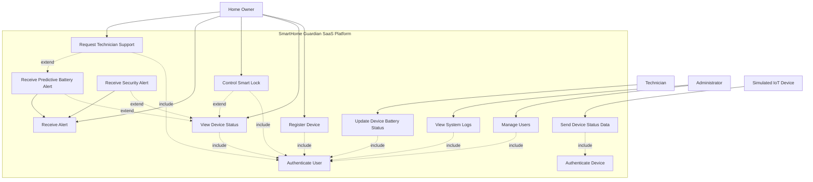

# Global Use Case Diagram

The diagram below refines actor responsibilities and aligns include and extend relationships with UML intent.

## Modeling Notes

- Authentication is modeled as an included use case for all protected user actions.
- Device telemetry submission includes device authentication before data is accepted.
- Receive Alert is modeled as a parent use case, specialized into security and predictive battery alert variants.
- Alerts are modeled as conditional extensions of status monitoring, since they are triggered only under specific conditions.
- Smart lock control extends status monitoring when lock action is initiated from a monitoring context.
- Simulated IoT Device is treated as an external actor sending telemetry to the platform.