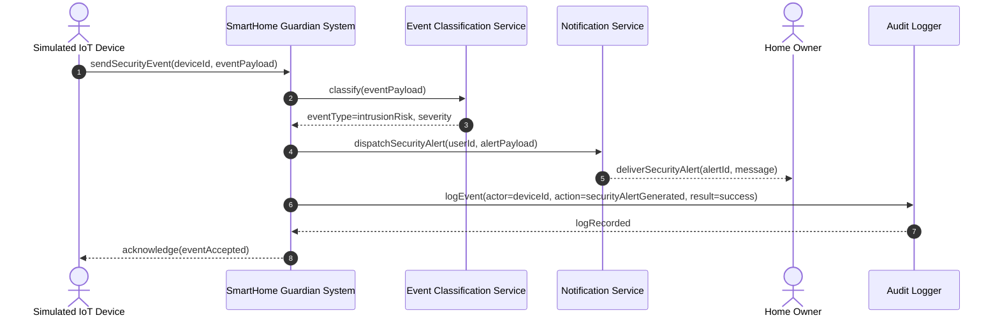
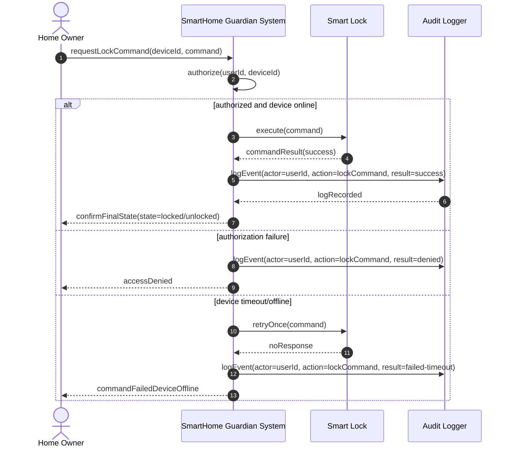
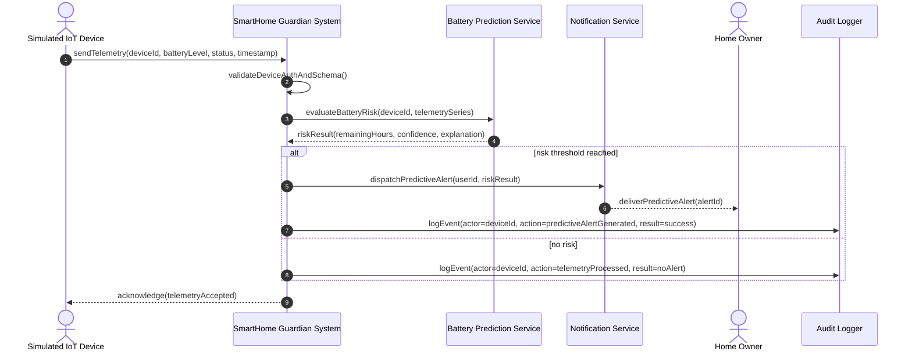

# System Sequence Diagrams (SSD)

This document provides system-level sequence diagrams for the core use cases.

## SSD-01: Intrusion Detection and Alert Dispatch

## SSD-02: Remote Smart Lock Control

## SSD-03: Device Health Check and Predictive Battery Notification

