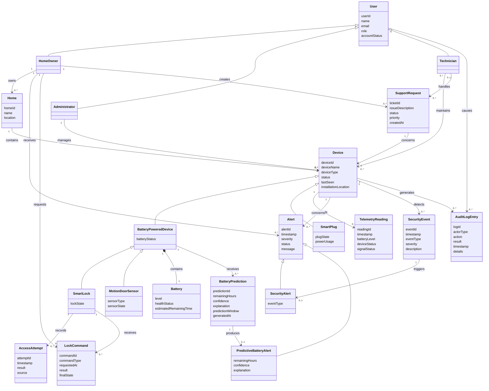

# Domain Model

This document presents the conceptual domain model for **SmartHome Guardian**.

A domain model is a visual dictionary of the important concepts in the problem domain. It shows conceptual classes, attributes, and meaningful associations between concepts. It does not describe software classes, internal services, databases, controllers, APIs, or implementation behavior.

SmartHome Guardian focuses on:

* Smart home monitoring
* Supported smart devices
* Battery health monitoring
* Explainable predictive battery alerts
* Security events and intrusion alerts
* Smart lock control
* Support requests
* Auditability and accountability

---

## Domain Model Diagram



---

## Key Domain Concepts

### User

Represents a person who interacts with SmartHome Guardian.

Specialized user roles:

* Home Owner
* Administrator
* Technician

The user role determines what the person is allowed to do in the system.

---

### Home Owner

Represents the main user who owns homes and monitors smart home devices.

A Home Owner can:

* Register devices
* Monitor device status
* Receive alerts
* Request lock/unlock commands
* Create support requests

---

### Administrator

Represents a privileged user responsible for managing platform-level users, devices, and system governance.

The Administrator does not own the devices but may manage them according to role permissions.

---

### Technician

Represents a support actor responsible for handling support requests and device maintenance issues.

A Technician may maintain devices or handle support requests but does not own the devices.

---

### Home

Represents a monitored home or property.

A Home is important because smart devices belong to a real home context. This helps avoid modeling devices as floating objects without ownership or location.

---

### Device

Represents a supported smart home device monitored by SmartHome Guardian.

Allowed device types are:

* Smart Lock
* Motion/Door Sensor
* Smart Plug

The model intentionally excludes:

* Cameras
* Voice assistants
* Mobile apps
* Payments
* Unsupported extra devices

---

### BatteryPoweredDevice

Represents a device that depends on battery health monitoring.

Battery-powered devices include:

* Smart Lock
* Motion/Door Sensor

Smart Plug is not modeled as battery-powered because it is a mains-powered reference device.

---

### SmartLock

Represents a battery-powered smart lock.

Important domain information:

* Current lock state
* Related lock commands
* Related access attempts
* Battery status

---

### MotionDoorSensor

Represents a battery-powered sensor that can detect motion, door activity, or suspicious events.

Important domain information:

* Sensor type
* Sensor state
* Battery status
* Security events

---

### SmartPlug

Represents a mains-powered smart plug.

Important domain information:

* Plug state
* Power usage

Smart Plug can report telemetry, but it should not trigger predictive battery alerts because it is not battery-powered.

---

### Battery

Represents the battery information of a battery-powered device.

A Battery is modeled as a separate concept because it is not only a simple number. It has level, health status, and estimated remaining time.

---

### TelemetryReading

Represents a device status reading sent by a simulated IoT device.

Telemetry supports:

* Device health monitoring
* Battery trend tracking
* Offline/reconnect observation
* Predictive battery alerting

---

### BatteryPrediction

Represents the output of SmartHome Guardian’s black-box predictive battery behavior.

It stores only the prediction result:

* Remaining hours
* Confidence
* Explanation
* Prediction window

It does not model machine learning internals.

---

### Alert

Represents a condition that requires user attention.

Specialized alert types:

* SecurityAlert
* PredictiveBatteryAlert

---

### SecurityAlert

Represents an alert generated from a suspicious security event.

Examples:

* Motion detected unexpectedly
* Door opened unexpectedly
* Unauthorized lock access attempt

---

### PredictiveBatteryAlert

Represents an explainable alert generated when a battery-powered device is predicted to reach a critically low battery level.

It must include:

* Remaining time
* Confidence
* Explanation

Example:

```txt
Remaining: 48h
Confidence: 85%
Explanation: Discharge rate increased due to frequent smart lock usage.
```

---

### SecurityEvent

Represents a security-related event detected by a device.

Examples:

* Motion detected
* Door opened
* Suspicious access behavior
* Unauthorized lock attempt

---

### AccessAttempt

Represents an attempt to access or operate a Smart Lock.

It can represent both successful and unsuccessful attempts.

---

### LockCommand

Represents a Home Owner request to lock or unlock a Smart Lock.

A LockCommand records the requested command, result, and final lock state.

Security concerns such as authorization, encrypted command handling, and audit logging are part of system behavior, but they are represented conceptually through LockCommand and AuditLogEntry.

---

### SupportRequest

Represents a support ticket created by a Home Owner for a device issue.

A support request concerns one device and may be handled by a Technician.

---

### AuditLogEntry

Represents a security and accountability record.

Audit logs may be generated by:

* User actions
* Device events
* Lock commands
* Failed authorization attempts
* Alert generation
* Support request activity

---

## Modeling Decisions

1. The domain model represents conceptual classes, not software classes.
2. No operations are shown because operations belong to the design model, not the domain model.
3. Associations are included only when the relationship needs to be remembered.
4. Association names use meaningful verb phrases instead of vague labels such as “uses” or “has.”
5. Smart Lock and Motion/Door Sensor are modeled as battery-powered devices.
6. Smart Plug is modeled as mains-powered and does not inherit from BatteryPoweredDevice.
7. Battery is modeled as a separate concept because it has meaningful domain information beyond a simple number.
8. TelemetryReading is included because predictive alerts depend on device health history.
9. BatteryPrediction is included only as black-box prediction output.
10. Security behavior is represented through SecurityEvent, AccessAttempt, LockCommand, Alert, and AuditLogEntry.
11. Support workflow is represented through SupportRequest.
12. The model avoids internal services such as NotificationService, PredictionService, AuditService, repositories, databases, controllers, and APIs.
13. The model remains inside the approved SmartHome Guardian scope.

---

## Build → Observe → Refine Note

The first draft correctly identified important concepts such as users, devices, batteries, alerts, and security events.

The refined version improves the model by:

* Removing software-design thinking from the domain model.
* Keeping only conceptual classes, attributes, and meaningful associations.
* Separating battery-powered devices from mains-powered devices.
* Adding Home as the container of monitored devices.
* Keeping Battery as a separate concept because it has meaningful domain information.
* Adding TelemetryReading, BatteryPrediction, LockCommand, SupportRequest, and AuditLogEntry because they are required by the SSDs, operation contracts, and requirements.
* Avoiding out-of-scope concepts such as cameras, voice assistants, mobile apps, payments, and extra devices.

---

## Micro-Experiment: Validate the Domain Model

### Goal

Check whether the domain model can explain real SmartHome Guardian behavior without exposing implementation details.

### Action

Simulate this scenario:

```txt
1. A Home Owner owns one Home.
2. The Home contains one Smart Lock, one Motion/Door Sensor, and one Smart Plug.
3. The Motion/Door Sensor detects suspicious motion.
4. The Smart Lock reports low battery telemetry.
5. SmartHome Guardian generates a security alert and a predictive battery alert.
6. The Home Owner creates a support request for the Smart Lock.
7. The Technician handles the support request.
```

### Expected Result

The model should be able to represent:

```txt
HomeOwner owns Home
Home contains Device
MotionDoorSensor detects SecurityEvent
SecurityEvent triggers SecurityAlert
SmartLock reports TelemetryReading
BatteryPrediction produces PredictiveBatteryAlert
HomeOwner receives Alert
HomeOwner creates SupportRequest
Technician handles SupportRequest
User or Device generates AuditLogEntry
```

### Observation

The refined model successfully represents the main SmartHome Guardian concepts and relationships while staying at the conceptual analysis level. It remains simple enough to understand but complete enough to support the SSDs, operation contracts, design class diagram, validation scenarios, and traceability matrix.
