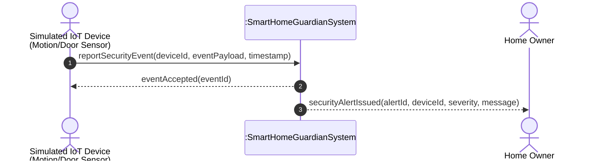
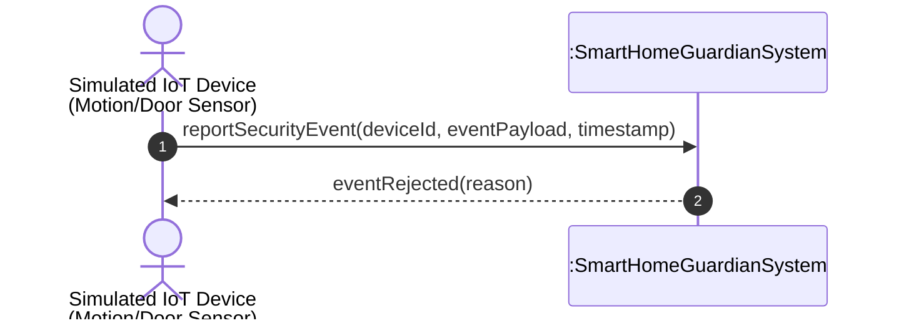
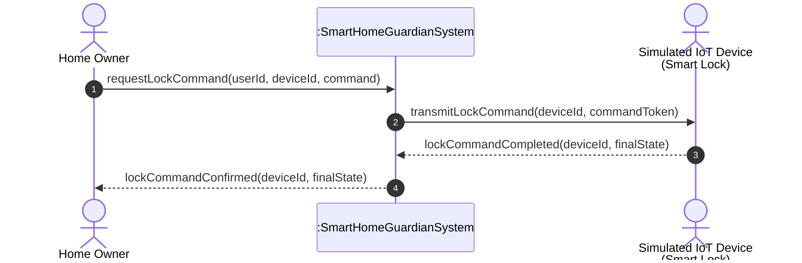
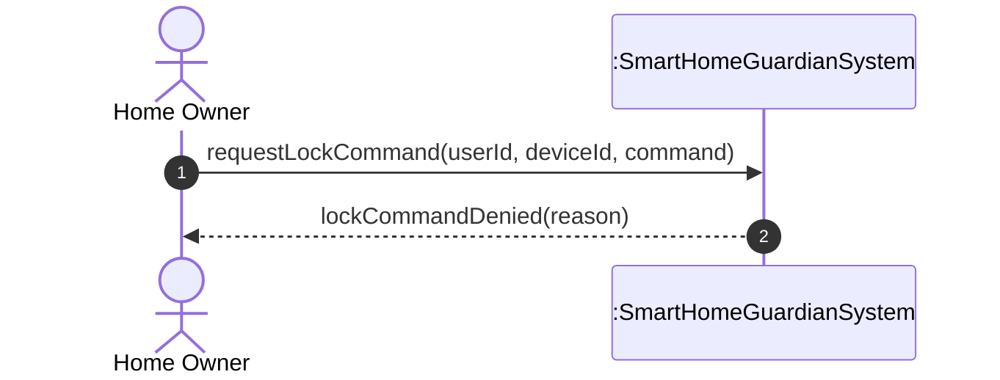
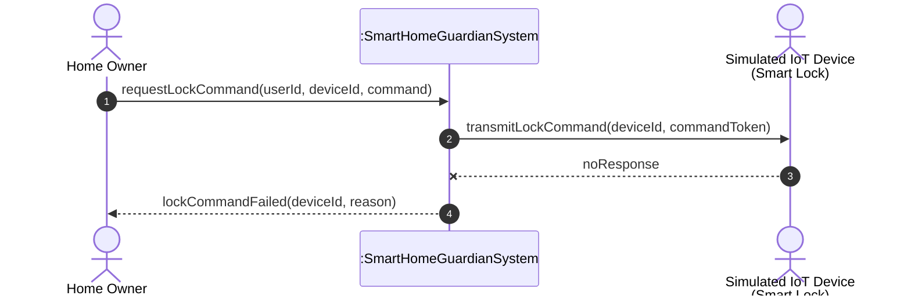
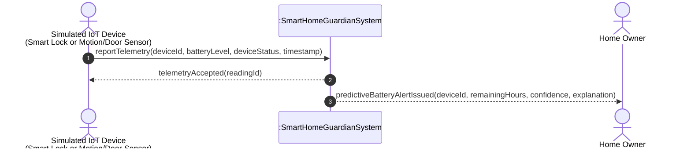
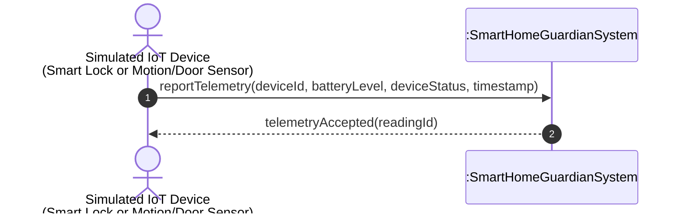
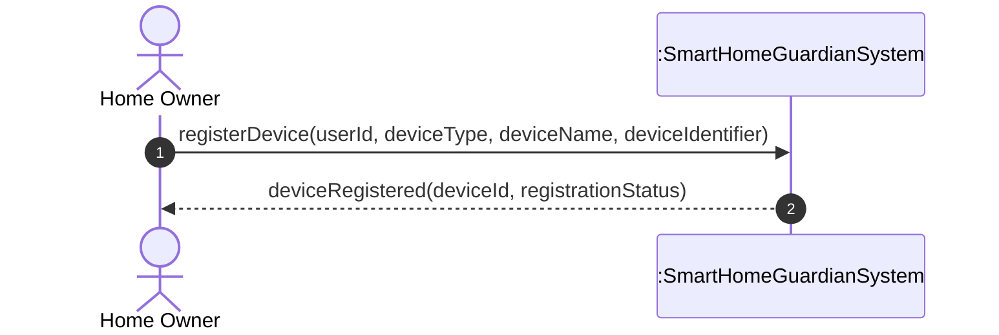
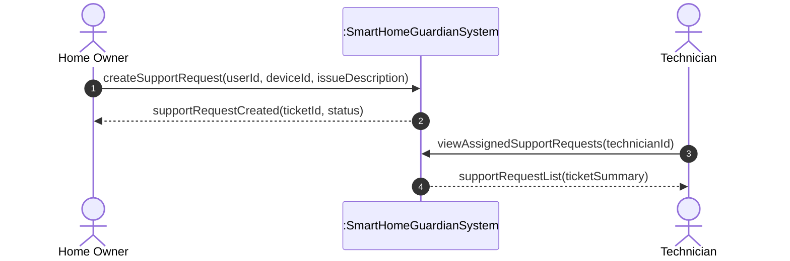

# System Sequence Diagrams (SSD)

This document provides System Sequence Diagrams for the core SmartHome Guardian use-case scenarios.

A System Sequence Diagram shows the time-ordered system events that external actors generate toward the system. In these diagrams, **SmartHome Guardian** is treated as a black box. The diagrams show what crosses the system boundary, not how the system internally performs the work.

Internal responsibilities such as authorization, classification, prediction, notification dispatch, telemetry storage, and audit logging are intentionally not shown as separate participants. These responsibilities are refined later in the design model, communication diagrams, operation contracts, and architecture artifacts.

---

## SSD-01: Report Security Event and Notify Home Owner

### Related Use Case

Intrusion Detection and Alert Dispatch

### Main Scenario

A simulated motion/door sensor detects suspicious activity and reports it to SmartHome Guardian. The system validates the event, determines that the event represents an intrusion risk, records the event, and notifies the Home Owner.



### Alternate Scenario: Invalid Device or Invalid Event Payload



### System Operations Identified

```txt
reportSecurityEvent(deviceId, eventPayload, timestamp)
eventAccepted(eventId)
eventRejected(reason)
securityAlertIssued(alertId, deviceId, severity, message)
```

### Notes

* The actor initiating the use case is the Simulated IoT Device.
* The Home Owner is an external actor who receives the system response.
* The SSD does not show internal classification, notification, or audit services.
* Event classification and audit logging are internal responsibilities of SmartHome Guardian.
* The operation name `reportSecurityEvent` is abstract and technology-independent.
* The diagram focuses only on events crossing the system boundary.

---

## SSD-02: Remotely Control Smart Lock

### Related Use Case

Remote Smart Lock Control

### Main Scenario

A Home Owner requests a lock or unlock operation. SmartHome Guardian authorizes the request, sends the command to the simulated smart lock, receives the final lock state, and confirms the result to the Home Owner.



### Alternate Scenario: Authorization Failure



### Alternate Scenario: Device Offline or Timeout



### System Operations Identified

```txt
requestLockCommand(userId, deviceId, command)
transmitLockCommand(deviceId, commandToken)
lockCommandCompleted(deviceId, finalState)
lockCommandConfirmed(deviceId, finalState)
lockCommandDenied(reason)
lockCommandFailed(deviceId, reason)
```

### Notes

* The Home Owner never communicates directly with the smart lock.
* SmartHome Guardian acts as the system boundary and control point.
* Authorization, command encryption, retry logic, and audit logging are internal responsibilities.
* The SSD shows the observable system events only.
* The operation name `requestLockCommand` is better than UI-specific names such as `clickLockButton`.
* The command token represents a conceptual secure command, not an implementation detail.

---

## SSD-03: Report Telemetry and Issue Predictive Battery Alert

### Related Use Case

Device Health Check and Predictive Battery Notification

### Main Scenario

A battery-powered simulated IoT device sends telemetry to SmartHome Guardian. The system accepts the telemetry, evaluates battery risk using black-box prediction behavior, and notifies the Home Owner when the device is predicted to reach a critically low battery level.



### Alternate Scenario: No Battery Risk



### Alternate Scenario: Invalid Telemetry


### System Operations Identified

```txt
reportTelemetry(deviceId, batteryLevel, deviceStatus, timestamp)
telemetryAccepted(readingId)
telemetryRejected(reason)
predictiveBatteryAlertIssued(deviceId, remainingHours, confidence, explanation)
```

### Notes

* Predictive battery logic is modeled as black-box system behavior.
* The SSD does not show AI internals or machine learning implementation.
* The prediction result must expose remaining time, confidence, and explanation.
* Only battery-powered devices should trigger predictive battery alerts.
* Smart Plug telemetry can be monitored, but it should not trigger battery prediction because it is a mains-powered reference device.
* Audit logging and telemetry persistence are internal system responsibilities.

---

## SSD-04: Register Device

### Related Use Case

Register Smart Home Device

### Main Scenario

A Home Owner registers a supported smart home device. SmartHome Guardian validates the device type and associates the device with the Home Owner account.



### Alternate Scenario: Unsupported Device Type


### System Operations Identified

```txt
registerDevice(userId, deviceType, deviceName, deviceIdentifier)
deviceRegistered(deviceId, registrationStatus)
deviceRegistrationRejected(reason)
```

### Notes

* Only Smart Lock, Motion/Door Sensor, and Smart Plug are supported device types.
* Cameras, voice assistants, payments, mobile apps, and extra devices are outside the system scope.
* Device ownership is established during registration.
* RBAC and device ownership checks are internal responsibilities.

---

## SSD-05: Create Support Request

### Related Use Case

Request Technical Support

### Main Scenario

A Home Owner creates a support request for a device issue. SmartHome Guardian records the request and makes it available for Technician handling.



### System Operations Identified

```txt
createSupportRequest(userId, deviceId, issueDescription)
supportRequestCreated(ticketId, status)
viewAssignedSupportRequests(technicianId)
supportRequestList(ticketSummary)
```

### Notes

* The Home Owner initiates the support request.
* The Technician interacts with the system to view assigned support work.
* Assignment logic is internal system behavior.
* The SSD avoids showing database, queue, notification, or internal ticketing services.

---

## SSD Modeling Decisions

These SSDs follow the following modeling rules:

1. The system is modeled as a black box.
2. Only external actors and the SmartHome Guardian system appear as lifelines.
3. Internal services are not shown as participants.
4. Operation names are abstract and technology-independent.
5. Each SSD focuses on one use-case scenario.
6. Alternate scenarios are separated for readability.
7. Return messages are shown only when they represent meaningful observable system responses.
8. Security behavior such as authorization, RBAC, encrypted commands, and audit logging is preserved as internal system responsibility notes.
9. Predictive AI behavior remains black-box only.
10. The diagrams support later operation contracts, class design, communication diagrams, architecture views, validation scenarios, and traceability mapping.

---

## Build → Observe → Refine Note

The first SSD draft was close to a design-level sequence diagram because it included internal participants such as classification, notification, prediction, and audit services.

This refined version moves those internal services out of the SSDs and keeps only the actors and the SmartHome Guardian system boundary. This makes the diagrams more faithful to analysis modeling and prepares the next step: operation contracts.

The system operations identified here should be used as input for:

```txt
04-analysis-model/operation-contracts.md
05-design-model/communication-diagrams.md
07-validation/system-test-scenarios.md
02-requirements/requirements-traceability-matrix.md
```

---

## Micro-Experiment: Validate SSD Behavior

### Goal

Check whether each SSD represents observable SmartHome Guardian behavior.

### Action

Simulate these five events:

```txt
1. Motion/Door Sensor reports suspicious door activity.
2. Home Owner sends unlock command to Smart Lock.
3. Smart Lock reports 15% battery.
4. Home Owner registers a Smart Plug.
5. Home Owner creates a support request.
```

### Expected Result

```txt
1. Security event is accepted and Home Owner receives a security alert.
2. Lock command is confirmed or rejected depending on authorization and device availability.
3. Telemetry is accepted and predictive alert is issued if the risk threshold is reached.
4. Device is registered if it is supported, or rejected if unsupported.
5. Support ticket is created and visible to the Technician.
```

### Observation

The SSDs now connect SmartHome Guardian’s use cases to later object-oriented design without exposing implementation details too early. They show external system events, observable system responses, and alternate scenarios while preserving the system boundary.
