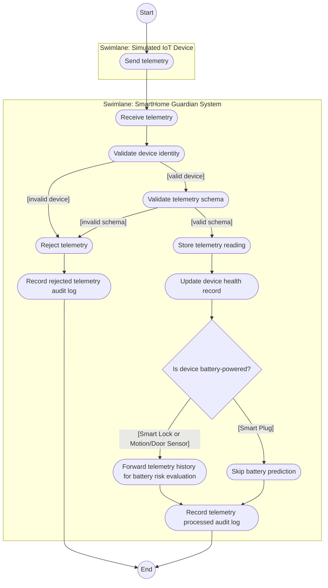
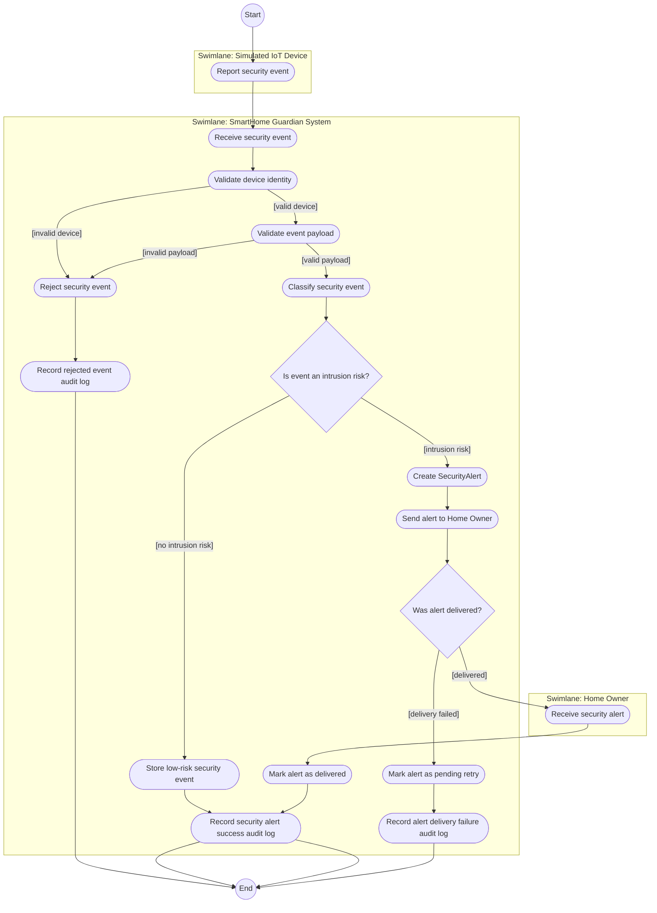
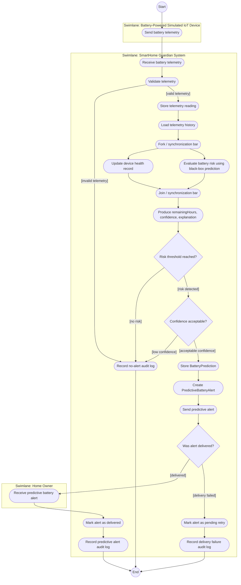
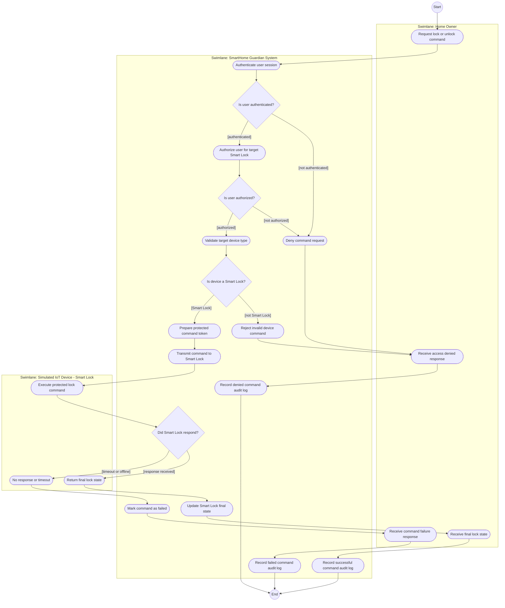
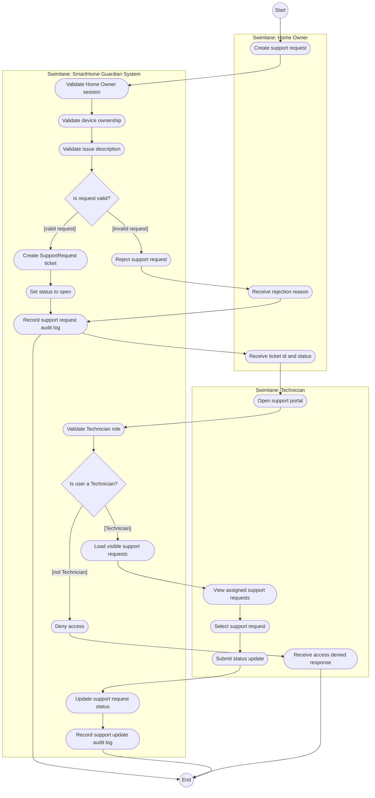

# Activity Diagrams

This document presents activity diagrams for key SmartHome Guardian workflows.

Activity diagrams model the dynamic behavior of the system by showing the flow of control from one action or activity to another. They are used here to describe workflow-level behavior without introducing implementation code.

These diagrams follow UML activity diagram concepts:

* Initial node
* Final node
* Action/activity states
* Transitions
* Decision branches with guard conditions
* Swimlanes for responsibility grouping
* Fork/join synchronization where parallel work is meaningful

GitHub Mermaid does not support every UML activity diagram symbol exactly, so these diagrams use GitHub-compatible Mermaid notation while preserving the intended UML meaning.

## Mermaid Notation Mapping

| UML Activity Diagram Concept  | GitHub Mermaid Representation                                                 |               |   |
| ----------------------------- | ----------------------------------------------------------------------------- | ------------- | - |
| Initial node                  | `Start((Start))`                                                              |               |   |
| Final node                    | `End((End))`                                                                  |               |   |
| Action state / Activity state | `Action([Action name])`                                                       |               |   |
| Transition                    | `A --> B`                                                                     |               |   |
| Branch / Decision             | `Decision{Question?}`                                                         |               |   |
| Guard condition               | `-->                                                                          | "[condition]" | ` |
| Swimlane                      | `subgraph LaneName["Swimlane: Name"]`                                         |               |   |
| Fork / Join synchronization   | `Fork([Fork / synchronization bar])` and `Join([Join / synchronization bar])` |               |   |

---

## AD-01: Device Telemetry Ingestion

### Purpose

Show how SmartHome Guardian receives telemetry from simulated IoT devices, validates it, stores it, updates device health, and decides whether battery prediction is needed.



### Notes

* Telemetry may come from Smart Lock, Motion/Door Sensor, or Smart Plug.
* Smart Lock and Motion/Door Sensor are battery-powered.
* Smart Plug is mains-powered and does not trigger battery prediction.
* Invalid telemetry is rejected and audit logged.
* Battery prediction remains black-box.
* The swimlanes separate device responsibility from system responsibility.

---

## AD-02: Security Alert Handling

### Purpose

Show how SmartHome Guardian handles a security event from a Motion/Door Sensor or Smart Lock and decides whether to create and deliver a security alert.



### Notes

* The event may be caused by suspicious motion, door activity, or lock-related access behavior.
* The system does not include cameras or video analysis.
* Low-risk events may be stored without notifying the Home Owner.
* Failed notification delivery does not delete the alert.
* Audit logging is required for rejected, successful, and failed alert flows.

---

## AD-03: Predictive Battery Alert Handling

### Purpose

Show how SmartHome Guardian evaluates battery risk and creates an explainable predictive battery alert when a supported battery-powered device may reach a critical battery level.



### Notes

* This workflow applies only to battery-powered devices:

  * Smart Lock
  * Motion/Door Sensor
* Smart Plug is excluded from predictive battery alerts.
* The AI module is treated as a black box.
* The prediction output must include:

  * remaining hours
  * confidence
  * explanation
* The fork/join shows that device health updating and battery risk evaluation may be treated as parallel workflow responsibilities after telemetry is stored.
* The system does not expose or implement machine learning internals.

Example predictive alert:

```txt
Remaining: 48h
Confidence: 85%
Explanation: Discharge rate increased due to frequent smart lock usage.
```

---

## AD-04: Smart Lock Command Request

### Purpose

Show how a Home Owner requests a lock/unlock command and how SmartHome Guardian handles authentication, authorization, command transmission, device response, failure, and audit logging.



### Notes

* The Home Owner never communicates directly with the Smart Lock.
* SmartHome Guardian acts as the control boundary.
* RBAC and device ownership checks happen before command transmission.
* The command is conceptually protected/encrypted before being sent.
* Timeout and offline behavior are explicitly modeled.
* Successful, denied, rejected, and failed commands are audit logged.

---

## AD-05: Technician Support Request Workflow

### Purpose

Show how a Home Owner creates a support request and how a Technician views and updates support work.



### Notes

* The Home Owner creates the support request.
* The support request must concern a registered supported device.
* The Technician can view only support requests allowed by role and assignment rules.
* Support request creation and status updates are audit logged.
* This workflow does not require implementation code.

---

## GitHub Mermaid Compatibility Notes

These diagrams avoid Mermaid parsing errors by using:

* Quoted guard labels: `-->|"[condition]"|`
* Simple node IDs: `ValidateDevice`, `RecordAudit`, `End`
* Rounded action nodes: `Action([Action name])`
* Decision nodes: `Decision{Question?}`
* Simple start and end nodes: `Start((Start))`, `End((End))`
* No raw bracket labels like `-->|[condition]|`
* No special Unicode symbols inside Mermaid nodes
* No `<br/>` inside node labels

---

## Activity Diagram Modeling Decisions

1. Activity diagrams show workflow-level behavior, not object structure.
2. Each diagram starts with an initial node and ends with a final node.
3. Action states are represented as rounded action nodes.
4. Decision nodes are represented with diamonds.
5. Guard conditions are written on outgoing transitions using quoted bracket-style labels.
6. Swimlanes group activities by responsible actor or system area.
7. Fork/join notation is approximated for GitHub Mermaid compatibility.
8. Smart Plug is included only for telemetry and power usage monitoring.
9. Smart Plug is excluded from predictive battery alerting.
10. Security-related workflows include audit logging.
11. Smart Lock command handling includes authentication, authorization, protected command transmission, timeout handling, and audit logging.
12. Predictive battery logic remains black-box and explainable.
13. The diagrams avoid implementation details such as databases, frameworks, APIs, or code.

---

## Traceability Targets

These activity diagrams support and refine behavior from:

```txt
03-use-case-model/fully-dressed-use-cases.md
04-analysis-model/system-sequence-diagrams.md
04-analysis-model/operation-contracts.md
05-design-model/class-diagram.md
05-design-model/communication-diagrams.md
05-design-model/grasp-patterns.md
07-validation/system-test-scenarios.md
02-requirements/requirements-traceability-matrix.md
```

---

## Build → Observe → Refine Note

These activity diagrams were created from the project’s SSDs, operation contracts, communication diagrams, class diagram, and GRASP responsibility assignments.

They refine SmartHome Guardian behavior by showing workflow decisions such as:

* valid vs invalid telemetry
* battery-powered vs mains-powered devices
* intrusion risk vs low-risk event
* prediction risk vs no risk
* authorized vs unauthorized lock command
* device response vs timeout
* valid vs invalid support request
* Technician access allowed vs denied

The diagrams help validate whether the modeled system behavior is complete before moving into architecture and final validation.

---

## Micro-Experiment: Validate Activity Workflows

### Goal

Check whether the activity diagrams describe real SmartHome Guardian behavior across common and failure scenarios.

### Action

Simulate these events:

```txt
1. Smart Lock sends valid battery telemetry.
2. Smart Plug sends power usage telemetry.
3. Motion/Door Sensor reports suspicious motion.
4. Unknown device sends telemetry.
5. Home Owner sends unlock command to Smart Lock.
6. Unauthorized user attempts lock command.
7. Smart Lock times out.
8. Home Owner creates a support request.
9. Technician views assigned support requests.
```

### Expected Result

```txt
1. Telemetry is accepted and battery prediction is evaluated.
2. Telemetry is accepted but battery prediction is skipped.
3. Security event is classified and a security alert is created if intrusion risk is detected.
4. Telemetry is rejected and audit logged.
5. Command is authorized, protected, sent, confirmed, and audit logged.
6. Command is denied and audit logged.
7. Command is marked failed and audit logged.
8. Support request is created and audit logged.
9. Technician sees only allowed support requests.
```

### Observation

The activity diagrams cover the main operational paths and failure paths of SmartHome Guardian. They preserve security, auditability, device scope, and black-box predictive alert behavior while avoiding implementation-level detail.

---

