# Core Class Diagram

This document presents the core design class diagram for **SmartHome Guardian**.

The design class diagram is different from the domain model. The domain model shows conceptual classes from the problem domain, while this design class diagram shows software classes, attributes, operations, visibility, dependencies, and collaboration structure.

The diagram follows a **Boundary-Control-Entity** organization and applies GRASP-oriented responsibility assignments.

The design remains aligned with the approved SmartHome Guardian scope:

* Smart Lock
* Motion/Door Sensor
* Smart Plug
* Home Owner
* Administrator
* Technician
* Simulated IoT Device
* Black-box predictive battery logic

Out-of-scope concepts such as cameras, voice assistants, mobile apps, payments, and unsupported devices are intentionally excluded.

---

## Core Class Diagram

```mermaid
classDiagram

%% =======================
%% BOUNDARY CLASSES
%% =======================

class HomeOwnerUI {
  <<boundary>>
  +requestLockCommand(userId: String, deviceId: String, command: LockCommandType): LockCommandResult
  +registerDevice(userId: String, deviceType: DeviceType, deviceName: String, deviceIdentifier: String): RegistrationResult
  +viewAlerts(userId: String): AlertList
  +createSupportRequest(userId: String, deviceId: String, issueDescription: String): SupportRequestResult
}

class TechnicianPortal {
  <<boundary>>
  +viewAssignedSupportRequests(technicianId: String): SupportRequestList
  +updateSupportRequestStatus(ticketId: String, status: SupportStatus): Boolean
  +viewDeviceHealth(deviceId: String): DeviceHealthSummary
}

class AdminDashboard {
  <<boundary>>
  +manageUser(userId: String, action: AdminAction): Boolean
  +manageDevice(deviceId: String, action: AdminAction): Boolean
  +viewSystemHealth(): SystemHealthSummary
}

class IoTGateway {
  <<boundary>>
  +reportSecurityEvent(deviceId: String, eventPayload: String, timestamp: DateTime): EventIngestionResult
  +reportTelemetry(deviceId: String, telemetryPayload: String, timestamp: DateTime): TelemetryIngestionResult
  +sendLockCommand(deviceId: String, commandToken: String): DeviceCommandResult
}

class NotificationBoundary {
  <<boundary>>
  +notifyHomeOwner(userId: String, alertMessage: String): NotificationResult
}

%% =======================
%% CONTROL CLASSES
%% =======================

class DeviceRegistrationControl {
  <<control>>
  +registerDevice(userId: String, deviceType: DeviceType, deviceName: String, deviceIdentifier: String): Device
  +validateSupportedDeviceType(deviceType: DeviceType): Boolean
}

class AuthorizationControl {
  <<control>>
  +authorizeUserForDevice(userId: String, deviceId: String, action: String): AuthorizationResult
  +verifyRole(userId: String, requiredRole: UserRole): Boolean
}

class LockCommandControl {
  <<control>>
  +requestLockCommand(userId: String, deviceId: String, command: LockCommandType): LockCommandResult
  +createCommandToken(command: LockCommandType): String
  +transmitLockCommand(deviceId: String, commandToken: String): DeviceCommandResult
  +recordCommandResult(commandId: String, result: CommandResult, finalState: LockState): Void
}

class SecurityEventControl {
  <<control>>
  +handleSecurityEvent(deviceId: String, eventPayload: String, timestamp: DateTime): EventIngestionResult
  +classifySecurityEvent(eventPayload: String): SecurityClassification
  +createSecurityAlert(event: SecurityEvent): SecurityAlert
}

class TelemetryControl {
  <<control>>
  +handleTelemetry(deviceId: String, telemetryPayload: String, timestamp: DateTime): TelemetryIngestionResult
  +validateTelemetry(deviceId: String, telemetryPayload: String): Boolean
  +updateDeviceHealth(deviceId: String, reading: TelemetryReading): Void
}

class BatteryPredictionControl {
  <<control>>
  +evaluateBatteryRisk(deviceId: String, telemetryHistory: String): BatteryPrediction
}

class AlertManagementControl {
  <<control>>
  +createSecurityAlert(deviceId: String, severity: AlertSeverity, message: String): SecurityAlert
  +createPredictiveBatteryAlert(deviceId: String, prediction: BatteryPrediction): PredictiveBatteryAlert
  +markAlertDelivered(alertId: String): Void
  +markAlertFailed(alertId: String, reason: String): Void
}

class SupportRequestControl {
  <<control>>
  +createSupportRequest(userId: String, deviceId: String, issueDescription: String): SupportRequest
  +findVisibleRequests(technicianId: String): SupportRequestList
  +updateStatus(ticketId: String, status: SupportStatus): Void
}

class AuditControl {
  <<control>>
  +recordAuditLog(actorId: String, actorType: ActorType, action: String, result: String, details: String): AuditLogEntry
}

%% =======================
%% SERVICE CLASSES
%% =======================

class NotificationService {
  <<service>>
  +sendNotification(userId: String, message: String, alertType: String): NotificationResult
}

class BatteryPredictionService {
  <<service>>
  +predictBattery(deviceId: String, telemetryHistory: String): BatteryPrediction
}

%% =======================
%% ENTITY CLASSES: USERS
%% =======================

class User {
  <<entity>>
  -userId: String
  -name: String
  -email: String
  -role: UserRole
  -accountStatus: AccountStatus
  +hasRole(role: UserRole): Boolean
}

class HomeOwner {
  <<entity>>
}

class Administrator {
  <<entity>>
}

class Technician {
  <<entity>>
}

User <|-- HomeOwner
User <|-- Administrator
User <|-- Technician

class Home {
  <<entity>>
  -homeId: String
  -name: String
  -location: String
}

%% =======================
%% ENTITY CLASSES: DEVICES
%% =======================

class Device {
  <<entity>>
  -deviceId: String
  -deviceName: String
  -deviceType: DeviceType
  -status: DeviceStatus
  -lastSeen: DateTime
  -installationLocation: String
  +updateStatus(status: DeviceStatus): Void
  +updateLastSeen(timestamp: DateTime): Void
}

class BatteryPoweredDevice {
  <<entity>>
  -batteryLevel: Float
  -batteryHealthStatus: BatteryHealthStatus
  +updateBatteryLevel(level: Float): Void
  +isBatteryCritical(): Boolean
}

class SmartLock {
  <<entity>>
  -lockState: LockState
  +updateLockState(newState: LockState): Void
}

class MotionDoorSensor {
  <<entity>>
  -sensorType: SensorType
  -sensorState: SensorState
  +updateSensorState(newState: SensorState): Void
}

class SmartPlug {
  <<entity>>
  -plugState: PlugState
  -powerUsage: Float
  +updatePlugState(newState: PlugState): Void
  +updatePowerUsage(powerUsage: Float): Void
}

Device <|-- BatteryPoweredDevice
BatteryPoweredDevice <|-- SmartLock
BatteryPoweredDevice <|-- MotionDoorSensor
Device <|-- SmartPlug

%% =======================
%% ENTITY CLASSES: TELEMETRY AND PREDICTION
%% =======================

class TelemetryReading {
  <<entity>>
  -readingId: String
  -timestamp: DateTime
  -batteryLevel: Float
  -deviceStatus: DeviceStatus
  -signalStatus: SignalStatus
  -powerUsage: Float
}

class DeviceHealthRecord {
  <<entity>>
  -recordId: String
  -lastStatus: DeviceStatus
  -lastBatteryLevel: Float
  -lastPowerUsage: Float
  -lastUpdated: DateTime
  +updateFromTelemetry(reading: TelemetryReading): Void
}

class BatteryPrediction {
  <<entity>>
  -predictionId: String
  -remainingHours: Float
  -confidence: Float
  -explanation: String
  -predictionWindow: String
  -generatedAt: DateTime
}

%% =======================
%% ENTITY CLASSES: ALERTS
%% =======================

class Alert {
  <<entity>>
  -alertId: String
  -timestamp: DateTime
  -severity: AlertSeverity
  -status: AlertStatus
  -message: String
  +markDelivered(): Void
  +markFailed(reason: String): Void
}

class SecurityAlert {
  <<entity>>
  -eventType: SecurityEventType
}

class PredictiveBatteryAlert {
  <<entity>>
  -remainingHours: Float
  -confidence: Float
  -explanation: String
}

Alert <|-- SecurityAlert
Alert <|-- PredictiveBatteryAlert

%% =======================
%% ENTITY CLASSES: SECURITY AND COMMANDS
%% =======================

class SecurityEvent {
  <<entity>>
  -eventId: String
  -timestamp: DateTime
  -eventType: SecurityEventType
  -severity: AlertSeverity
  -description: String
}

class AccessAttempt {
  <<entity>>
  -attemptId: String
  -timestamp: DateTime
  -result: AccessResult
  -source: String
}

class LockCommand {
  <<entity>>
  -commandId: String
  -commandType: LockCommandType
  -requestedAt: DateTime
  -result: CommandResult
  -finalState: LockState
  +markSuccess(finalState: LockState): Void
  +markFailure(reason: String): Void
}

%% =======================
%% ENTITY CLASSES: SUPPORT AND AUDIT
%% =======================

class SupportRequest {
  <<entity>>
  -ticketId: String
  -issueDescription: String
  -status: SupportStatus
  -priority: SupportPriority
  -createdAt: DateTime
  +updateStatus(status: SupportStatus): Void
}

class AuditLogEntry {
  <<entity>>
  -logId: String
  -actorId: String
  -actorType: ActorType
  -action: String
  -result: String
  -timestamp: DateTime
  -details: String
}

%% =======================
%% VALUE TYPES AND ENUMS
%% =======================

class DateTime
class DeviceType
class DeviceStatus
class LockState
class LockCommandType
class CommandResult
class UserRole
class AccountStatus
class AlertSeverity
class AlertStatus
class SecurityEventType
class SensorType
class SensorState
class PlugState
class SignalStatus
class BatteryHealthStatus
class SupportStatus
class SupportPriority
class ActorType
class AdminAction
class AccessResult
class AuthorizationResult
class RegistrationResult
class LockCommandResult
class EventIngestionResult
class TelemetryIngestionResult
class DeviceCommandResult
class NotificationResult
class SecurityClassification
class SupportRequestResult
class SupportRequestList
class AlertList
class DeviceHealthSummary
class SystemHealthSummary

%% =======================
%% STRUCTURAL ASSOCIATIONS
%% =======================

HomeOwner "1" --> "0..*" Home : owns
Home "1" *-- "0..*" Device : devices

Device "1" --> "0..*" TelemetryReading : readings
Device "1" --> "1" DeviceHealthRecord : healthRecord
BatteryPoweredDevice "1" --> "0..*" BatteryPrediction : predictions

Device "1" --> "0..*" Alert : alerts
HomeOwner "1" --> "0..*" Alert : receivedAlerts
SecurityEvent "1" --> "0..1" SecurityAlert : securityAlert
BatteryPrediction "1" --> "0..1" PredictiveBatteryAlert : predictiveAlert

Device "1" --> "0..*" SecurityEvent : securityEvents
SmartLock "1" --> "0..*" AccessAttempt : accessAttempts
HomeOwner "1" --> "0..*" LockCommand : lockCommands
SmartLock "1" --> "0..*" LockCommand : receivedCommands

HomeOwner "1" --> "0..*" SupportRequest : supportRequests
SupportRequest "1" --> "1" Device : affectedDevice
Technician "0..1" --> "0..*" SupportRequest : assignedRequests

User "1" --> "0..*" AuditLogEntry : auditEntries
Device "1" --> "0..*" AuditLogEntry : deviceAuditEntries

%% =======================
%% BOUNDARY TO CONTROL DEPENDENCIES
%% =======================

HomeOwnerUI ..> DeviceRegistrationControl : register
HomeOwnerUI ..> LockCommandControl : command
HomeOwnerUI ..> SupportRequestControl : support
HomeOwnerUI ..> AlertManagementControl : alerts

TechnicianPortal ..> SupportRequestControl : support
TechnicianPortal ..> TelemetryControl : health

AdminDashboard ..> DeviceRegistrationControl : devices
AdminDashboard ..> AuthorizationControl : access

IoTGateway ..> SecurityEventControl : securityEvent
IoTGateway ..> TelemetryControl : telemetry
IoTGateway ..> LockCommandControl : commandResult

NotificationBoundary ..> NotificationService : notify

%% =======================
%% CONTROL TO CONTROL / SERVICE DEPENDENCIES
%% =======================

DeviceRegistrationControl ..> AuthorizationControl : authorize
LockCommandControl ..> AuthorizationControl : authorize
SecurityEventControl ..> AlertManagementControl : alert
TelemetryControl ..> BatteryPredictionControl : predict
BatteryPredictionControl ..> BatteryPredictionService : blackBoxPrediction
AlertManagementControl ..> NotificationBoundary : deliver
SupportRequestControl ..> AuthorizationControl : authorize

SecurityEventControl ..> AuditControl : audit
TelemetryControl ..> AuditControl : audit
LockCommandControl ..> AuditControl : audit
AlertManagementControl ..> AuditControl : audit
SupportRequestControl ..> AuditControl : audit
DeviceRegistrationControl ..> AuditControl : audit

%% =======================
%% CONTROL TO ENTITY DEPENDENCIES
%% =======================

DeviceRegistrationControl ..> Device : createOrValidate
LockCommandControl ..> LockCommand : createOrUpdate
LockCommandControl ..> SmartLock : command
SecurityEventControl ..> SecurityEvent : create
TelemetryControl ..> TelemetryReading : create
TelemetryControl ..> DeviceHealthRecord : update
BatteryPredictionControl ..> BatteryPrediction : create
AlertManagementControl ..> Alert : createOrUpdate
SupportRequestControl ..> SupportRequest : createOrUpdate
AuditControl ..> AuditLogEntry : create
```



---

## Design Notes

### Boundary Classes

Boundary classes represent interaction points between external actors and SmartHome Guardian.

* `HomeOwnerUI` handles Home Owner interactions.
* `TechnicianPortal` handles Technician support workflows.
* `AdminDashboard` handles Administrator management activities.
* `IoTGateway` handles simulated device messages.
* `NotificationBoundary` represents alert delivery to the Home Owner.

---

### Control Classes

Control classes coordinate use-case behavior.

* `DeviceRegistrationControl` handles device registration.
* `AuthorizationControl` handles RBAC and device ownership checks.
* `LockCommandControl` coordinates smart lock commands.
* `SecurityEventControl` processes intrusion/security events.
* `TelemetryControl` processes device telemetry.
* `BatteryPredictionControl` coordinates black-box battery risk evaluation.
* `AlertManagementControl` creates and manages alerts.
* `SupportRequestControl` manages support request workflows.
* `AuditControl` coordinates audit log creation.

---

### Entity Classes

Entity classes represent important domain state.

Important entity groups:

* Users: `User`, `HomeOwner`, `Administrator`, `Technician`
* Home structure: `Home`
* Devices: `Device`, `BatteryPoweredDevice`, `SmartLock`, `MotionDoorSensor`, `SmartPlug`
* Monitoring: `TelemetryReading`, `DeviceHealthRecord`, `BatteryPrediction`
* Alerts: `Alert`, `SecurityAlert`, `PredictiveBatteryAlert`
* Security: `SecurityEvent`, `AccessAttempt`, `LockCommand`
* Support and audit: `SupportRequest`, `AuditLogEntry`

---

### Black-Box Battery Prediction

`BatteryPredictionService` is modeled as a black-box service.

It accepts:

* device identifier
* telemetry history

It returns:

* remaining hours
* confidence
* explanation

It does not expose or implement machine learning internals.

---

### Smart Plug Design Decision

`SmartPlug` inherits directly from `Device`, not from `BatteryPoweredDevice`.

This is intentional because Smart Plug is mains-powered. It can report telemetry and power usage, but it should not trigger predictive battery alerts.

---

### Visibility and Operation Notation

The class diagram uses standard visibility notation:

* `+` public operation
* `-` private attribute

The diagram avoids unnecessary no-argument constructors and simple getters/setters. Only operations that support the SSDs, operation contracts, and communication diagrams are included.

---

### Association and Dependency Notation

The diagram uses:

* Generalization for inheritance relationships.
* Composition where the whole strongly owns the part, such as `Home` containing `Device`.
* Associations for important structural relationships.
* Dependency lines for use-case collaboration between boundary, control, service, and entity classes.

The model uses association lines for important object references and dependencies for temporary use-case collaboration.

---

### Security Design Decisions

Security is represented through:

* `AuthorizationControl`
* `AuditControl`
* `SecurityEvent`
* `AccessAttempt`
* `LockCommand`
* `AuditLogEntry`

The design supports:

* RBAC
* device ownership checks
* unauthorized access handling
* audit logging
* conceptually protected lock commands

---

## GRASP Responsibility Notes

### Information Expert

The following classes hold the information needed to answer domain questions:

* `Device`
* `BatteryPoweredDevice`
* `SmartLock`
* `MotionDoorSensor`
* `SmartPlug`
* `TelemetryReading`
* `DeviceHealthRecord`
* `BatteryPrediction`
* `Alert`
* `SecurityEvent`
* `LockCommand`
* `SupportRequest`
* `AuditLogEntry`

### Controller

The following classes coordinate system operations from SSDs:

* `DeviceRegistrationControl`
* `LockCommandControl`
* `SecurityEventControl`
* `TelemetryControl`
* `AlertManagementControl`
* `SupportRequestControl`

### Creator

The following creation responsibilities are assigned:

* `DeviceRegistrationControl` creates supported `Device` objects.
* `SecurityEventControl` creates `SecurityEvent` objects.
* `TelemetryControl` creates `TelemetryReading` objects.
* `BatteryPredictionControl` creates `BatteryPrediction` results.
* `AlertManagementControl` creates `SecurityAlert` and `PredictiveBatteryAlert` objects.
* `LockCommandControl` creates `LockCommand` objects.
* `SupportRequestControl` creates `SupportRequest` objects.
* `AuditControl` creates `AuditLogEntry` objects.

### Low Coupling

The design reduces coupling by:

* Separating boundary, control, entity, and service responsibilities.
* Keeping prediction logic behind `BatteryPredictionService`.
* Avoiding direct Home Owner to Smart Lock communication.
* Using control classes to coordinate use cases.
* Keeping audit logging centralized through `AuditControl`.

### High Cohesion

Each class has a focused responsibility:

* Boundary classes handle actor or device interaction.
* Control classes coordinate use-case logic.
* Entity classes hold important domain state.
* Services handle external or specialized technical behavior.

---

## Traceability to SSDs and Operation Contracts

This class diagram supports the following SSD operations:

```txt
reportSecurityEvent(deviceId, eventPayload, timestamp)
eventAccepted(eventId)
eventRejected(reason)
securityAlertIssued(alertId, deviceId, severity, message)

requestLockCommand(userId, deviceId, command)
transmitLockCommand(deviceId, commandToken)
lockCommandCompleted(deviceId, finalState)
lockCommandConfirmed(deviceId, finalState)
lockCommandDenied(reason)
lockCommandFailed(deviceId, reason)

reportTelemetry(deviceId, batteryLevel, deviceStatus, timestamp)
telemetryAccepted(readingId)
telemetryRejected(reason)
predictiveBatteryAlertIssued(deviceId, remainingHours, confidence, explanation)

registerDevice(userId, deviceType, deviceName, deviceIdentifier)
deviceRegistered(deviceId, registrationStatus)
deviceRegistrationRejected(reason)

createSupportRequest(userId, deviceId, issueDescription)
supportRequestCreated(ticketId, status)
viewAssignedSupportRequests(technicianId)
supportRequestList(ticketSummary)
```

---

## Build → Observe → Refine Note

The first draft correctly used a Boundary-Control-Entity structure and included GRASP-oriented annotations.

The refined version improves the design by:

* Removing battery behavior from `SmartPlug`.
* Renaming `MotionSensor` to `MotionDoorSensor`.
* Adding `TelemetryReading`, `DeviceHealthRecord`, `SecurityEvent`, `SecurityAlert`, `PredictiveBatteryAlert`, `LockCommand`, `SupportRequest`, and `AuditLogEntry`.
* Aligning operations with SSDs and operation contracts.
* Keeping battery prediction black-box.
* Representing RBAC, audit logs, and unauthorized access handling.
* Preserving the allowed SmartHome Guardian device scope.
* Using design class diagram notation with visibility, operations, dependencies, and structural associations.

---

## Micro-Experiment: Validate the Class Diagram

### Goal

Check whether the class diagram supports the main SmartHome Guardian behaviors.

### Action

Simulate these system events:

```txt
1. Home Owner registers a Smart Lock.
2. Motion/Door Sensor reports suspicious motion.
3. Smart Lock reports low battery telemetry.
4. Home Owner sends unlock command.
5. Smart Lock times out.
6. Home Owner creates a support request.
7. Technician views assigned support requests.
```

### Expected Result

```txt
1. DeviceRegistrationControl creates a SmartLock.
2. SecurityEventControl creates SecurityEvent and SecurityAlert.
3. TelemetryControl creates TelemetryReading and BatteryPredictionControl produces BatteryPrediction.
4. LockCommandControl creates LockCommand and sends protected command.
5. LockCommandControl marks command as failed and AuditControl records failure.
6. SupportRequestControl creates SupportRequest.
7. SupportRequestControl returns visible support requests to Technician.
```

### Observation

The refined class diagram supports the core system behaviors while staying aligned with the SmartHome Guardian scope, SSDs, operation contracts, communication diagrams, GRASP responsibilities, and security requirements.
