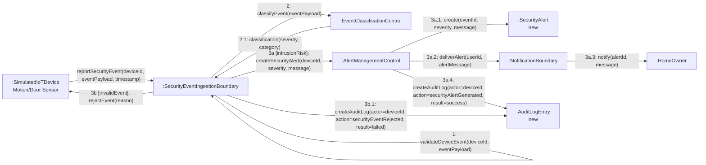
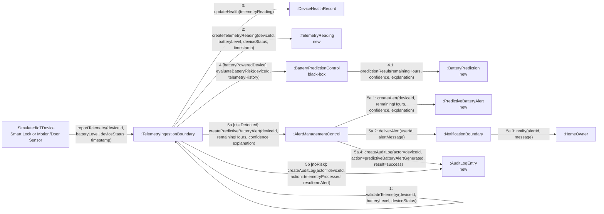
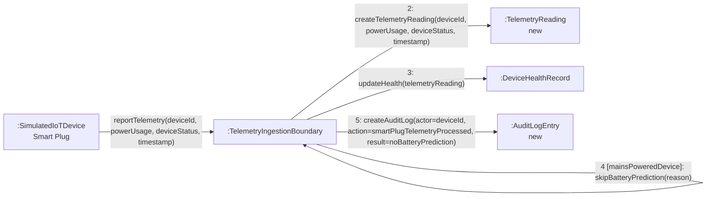
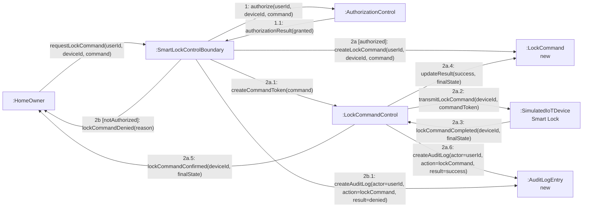
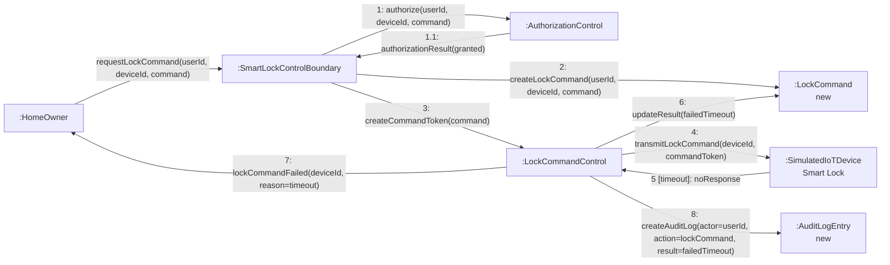
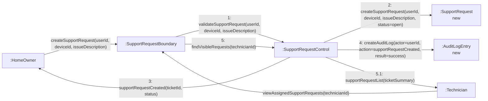

# Communication Diagrams

This document presents communication diagrams for key SmartHome Guardian design interactions.

A communication diagram shows how objects collaborate by sending messages across links. Unlike a System Sequence Diagram, which treats the system as a black box, a communication diagram shows selected internal design objects and their message interactions.

These diagrams use GitHub-compatible Mermaid `flowchart` notation to approximate UML communication diagram notation. Message numbers are included to show message order.

The diagrams follow these rules:

* Show collaborating objects.
* Use links between objects.
* Use numbered messages to show sequence.
* Use conditional message labels where needed.
* Use boundary, control, and entity object roles.
* Avoid unnecessary implementation details.
* Keep the AI prediction module black-box.
* Use GitHub-safe Mermaid syntax.

---

## CD-01: Security Alert Flow

### Related SSD

* SSD-01: Report Security Event and Notify Home Owner

### Related Use Case

* Intrusion Detection and Alert Dispatch

### Purpose

Show how SmartHome Guardian processes a security event from a simulated Motion/Door Sensor and delivers a security alert to the Home Owner.



### Design Notes

* `:SecurityEventIngestionBoundary` receives the security event from the simulated device.
* `:EventClassificationControl` classifies the event as low-risk or intrusion-risk.
* `:AlertManagementControl` coordinates alert creation and delivery.
* `:SecurityAlert new` shows that a new alert instance is created.
* `:AuditLogEntry new` shows that security-relevant actions are recorded.
* Conditional paths use `3a [intrusionRisk]` and `3b [invalidEvent]`.
* The Home Owner receives the alert but does not see internal classification or audit behavior.
* Cameras, video, voice, and unsupported device types are excluded.

---

## CD-02: Predictive Battery Alert Flow

### Related SSD

* SSD-03: Report Telemetry and Issue Predictive Battery Alert

### Related Use Case

* Device Health Check and Predictive Battery Notification

### Purpose

Show how SmartHome Guardian processes telemetry from a battery-powered device and generates an explainable predictive battery alert.



### Design Notes

* Predictive battery behavior is modeled through `:BatteryPredictionControl`, but it remains black-box.
* The black-box prediction result is represented by `:BatteryPrediction`.
* The prediction output includes:

  * remaining hours
  * confidence
  * explanation
* `:PredictiveBatteryAlert new` represents the creation of a new alert.
* Smart Lock and Motion/Door Sensor can trigger predictive battery alerts.
* Audit logging records both alert and no-alert outcomes.
* The diagram does not model machine learning internals.

---

## CD-03: Smart Plug Telemetry Flow

### Related SSD

* SSD-03: Report Telemetry and Issue Predictive Battery Alert

### Related Use Case

* Device Health Check and Predictive Battery Notification

### Purpose

Show how SmartHome Guardian handles Smart Plug telemetry without triggering battery prediction.



### Design Notes

* Smart Plug telemetry is accepted and processed as device health information.
* Smart Plug is mains-powered, so it does not trigger battery prediction.
* The telemetry reading is still recorded.
* Audit logging confirms that telemetry was processed without battery prediction.
* This keeps Smart Plug inside system scope without incorrectly modeling it as battery-powered.

---

## CD-04: Remote Smart Lock Command Flow

### Related SSD

* SSD-02: Remotely Control Smart Lock

### Related Use Case

* Remote Smart Lock Control

### Purpose

Show how SmartHome Guardian handles a Home Owner lock/unlock request, including authorization, secure command preparation, device response, and audit logging.



### Design Notes

* The Home Owner never communicates directly with the Smart Lock.
* `:SmartLockControlBoundary` receives the Home Owner request.
* `:AuthorizationControl` checks RBAC and device ownership.
* `:LockCommandControl` coordinates secure command preparation and transmission.
* `:LockCommand new` records the command request and result.
* The command token represents conceptually encrypted or protected command transmission.
* Successful and denied commands are audit logged.

---

## CD-05: Smart Lock Timeout Flow

### Related SSD

* SSD-02: Remotely Control Smart Lock

### Related Use Case

* Remote Smart Lock Control

### Purpose

Show how SmartHome Guardian handles a lock command when the Smart Lock is offline or times out.



### Design Notes

* This flow handles offline or non-responsive Smart Lock behavior.
* The command is created because the user was authorized.
* The Smart Lock state is not updated unless a trusted final state is received.
* The failed command result is stored in `:LockCommand`.
* The Home Owner receives a failure response.
* Timeout is audit logged for accountability and troubleshooting.

---

## CD-06: Support Request Flow

### Related SSD

* SSD-05: Create Support Request

### Related Use Case

* Request Technical Support

### Purpose

Show how a Home Owner creates a support request and how the request becomes available for Technician handling.



### Design Notes

* `:SupportRequestBoundary` receives Home Owner and Technician support interactions.
* `:SupportRequestControl` coordinates validation, creation, and retrieval.
* `:SupportRequest new` represents a newly created support ticket.
* Technician access must respect role-based access control.
* Audit logging records support request creation.
* The support request concerns a registered supported device.

---

## GitHub Mermaid Compatibility Notes

These diagrams use GitHub-safe Mermaid syntax.

To avoid Mermaid parse errors, the diagrams use:

* Quoted edge labels: `-->|"message()"|`
* Simple node IDs: `Device`, `AlertCtrl`, `Audit`
* Quoted node text: `Node[":ClassName"]`
* `\n` instead of `<br/>`
* `new` instead of `{new}` inside node labels
* No raw braces `{}` in labels
* No unquoted parentheses or commas in message labels

---

## Communication Diagram Modeling Decisions

1. Communication diagrams show internal collaboration between design objects.
2. Objects are written in instance style, such as `:SmartLockControlBoundary`.
3. New conceptual objects are marked with `new`.
4. Numbered messages show execution order.
5. Conditional messages use guards such as `[authorized]`, `[intrusionRisk]`, and `[noRisk]`.
6. Nested numbering such as `2a.1` shows messages inside a conditional path.
7. Boundary, control, and entity responsibilities are separated.
8. The first external message is shown but not numbered.
9. Audit logging appears in every security-relevant or accountability-relevant flow.
10. Battery prediction remains black-box.
11. Smart Plug is treated as mains-powered and excluded from battery prediction.
12. Out-of-scope concepts such as cameras, voice assistants, mobile apps, payments, and unsupported devices are excluded.

---

## Build → Observe → Refine Note

The first draft correctly captured the alert pipeline, but it used sequence diagram notation. This refined version uses communication-diagram style by showing object links and numbered messages.

The diagrams were also adjusted to render correctly on GitHub by quoting message labels and avoiding Mermaid-sensitive syntax.

The design separates six important SmartHome Guardian flows:

* Security alert flow
* Predictive battery alert flow
* Smart Plug telemetry flow
* Remote Smart Lock command flow
* Smart Lock timeout flow
* Support request flow

These communication diagrams now align with the SSDs, operation contracts, domain model, GRASP responsibility design, and validation scenarios.

---

## Micro-Experiment: Validate Communication Flows

### Goal

Check whether the communication diagrams explain real SmartHome Guardian collaborations.

### Action

Simulate the following scenarios:

```txt
1. Motion/Door Sensor reports suspicious motion.
2. Smart Lock reports low battery telemetry.
3. Smart Plug reports power usage telemetry.
4. Home Owner sends unlock command to Smart Lock.
5. Smart Lock does not respond to a lock command.
6. Home Owner creates a support request.
7. Notification delivery fails during alert dispatch.
```

### Expected Result

```txt
1. Security event is classified, alert is created, Home Owner is notified, and audit log is created.
2. Telemetry is stored, battery risk is evaluated, predictive alert is created, and audit log is created.
3. Smart Plug telemetry is processed without battery prediction.
4. Lock command is authorized, command token is prepared, Smart Lock responds, result is recorded, and audit log is created.
5. Timeout is recorded, command result is marked failed, Home Owner is notified, and audit log is created.
6. Support request is created and later visible to Technician.
7. Failed delivery is recorded and can be retried.
```

### Observation

The communication diagrams now show how SmartHome Guardian design objects collaborate while preserving the actual system scope, security lens, black-box AI constraint, and allowed device list.

---

## Traceability Targets

These communication diagrams should be traceable to:

```txt
04-analysis-model/system-sequence-diagrams.md
04-analysis-model/operation-contracts.md
04-analysis-model/domain-model.md
05-design-model/class-diagram.md
05-design-model/grasp-patterns.md
07-validation/system-test-scenarios.md
02-requirements/requirements-traceability-matrix.md
```
