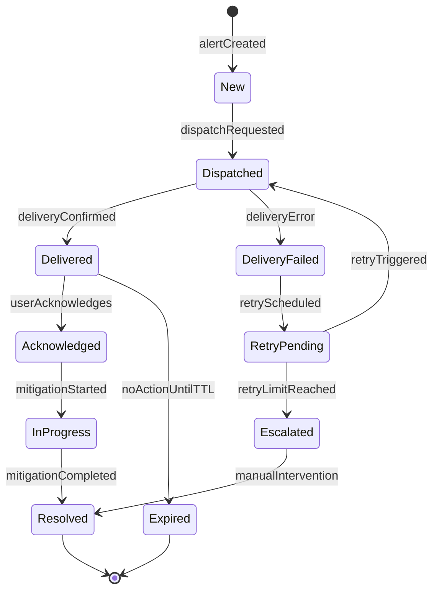

# Alert State Machine

The state machine models the lifecycle of both security and predictive battery alerts.

## State Definitions

- New: Alert record has been created and persisted.
- Dispatched: Alert has been handed to the notification channel.
- Delivered: Alert reached the intended recipient.
- DeliveryFailed: Delivery attempt failed due to channel or network issue.
- RetryPending: Alert waits for retry execution.
- Escalated: Alert exceeded retry policy and requires higher-priority handling.
- Acknowledged: User explicitly acknowledged the alert.
- InProgress: Mitigation or follow-up action is ongoing.
- Resolved: Alert handling completed and closed.
- Expired: Alert lifetime elapsed without acknowledgement.