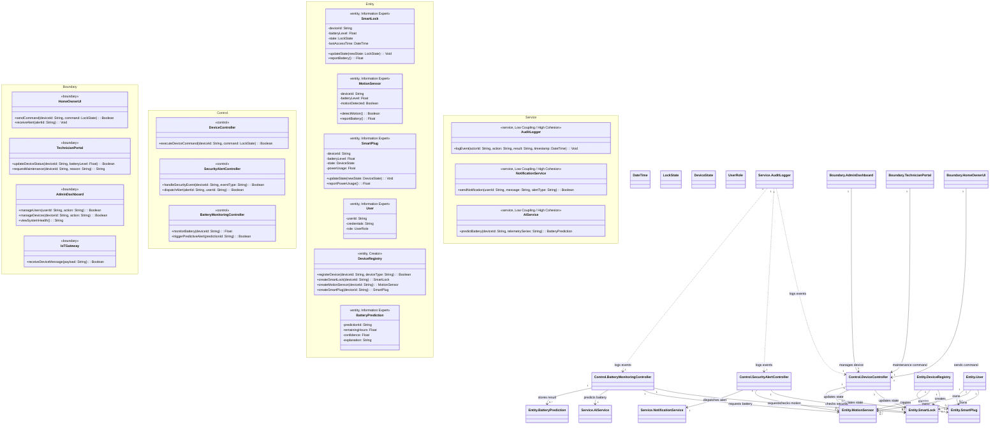

# Core Class Diagram

This diagram follows a Boundary-Control-Entity organization and keeps GRASP-oriented role annotations used in the original model.

```mermaid
classDiagram

%% =======================
%% Boundary Package
%% =======================
namespace Boundary {
    class HomeOwnerUI {
        <<boundary>>
        +sendCommand(deviceId: String, command: LockState): Boolean
        +receiveAlert(alertId: String): Void
    }

    class TechnicianPortal {
        <<boundary>>
        +updateDeviceStatus(deviceId: String, batteryLevel: Float): Boolean
        +requestMaintenance(deviceId: String, reason: String): String
    }

    class AdminDashboard {
        <<boundary>>
        +manageUsers(userId: String, action: String): Boolean
        +manageDevices(deviceId: String, action: String): Boolean
        +viewSystemHealth(): String
    }

    class IoTGateway {
        <<boundary>>
        +receiveDeviceMessage(payload: String): Boolean
    }
}

%% =======================
%% Control Package
%% =======================
namespace Control {
    class DeviceController {
        <<control>>
        +executeDeviceCommand(deviceId: String, command: LockState): Boolean
    }

    class SecurityAlertController {
        <<control>>
        +handleSecurityEvent(deviceId: String, eventType: String): Boolean
        +dispatchAlert(alertId: String, userId: String): Boolean
    }

    class BatteryMonitoringController {
        <<control>>
        +monitorBattery(deviceId: String): Float
        +triggerPredictiveAlert(predictionId: String): Boolean
    }
}

%% =======================
%% Entity Package
%% =======================
namespace Entity {
    class SmartLock {
        <<entity, Information Expert>>
        -deviceId: String
        -batteryLevel: Float
        -state: LockState
        -lastAccessTime: DateTime
        +updateState(newState: LockState): Void
        +reportBattery(): Float
    }

    class MotionSensor {
        <<entity, Information Expert>>
        -deviceId: String
        -batteryLevel: Float
        -motionDetected: Boolean
        +detectMotion(): Boolean
        +reportBattery(): Float
    }

    class SmartPlug {
        <<entity, Information Expert>>
        -deviceId: String
        -batteryLevel: Float
        -state: DeviceState
        -powerUsage: Float
        +updateState(newState: DeviceState): Void
        +reportPowerUsage(): Float
    }

    class User {
        <<entity, Information Expert>>
        -userId: String
        -credentials: String
        -role: UserRole
    }

    class DeviceRegistry {
        <<entity, Creator>>
        +registerDevice(deviceId: String, deviceType: String): Boolean
        +createSmartLock(deviceId: String): SmartLock
        +createMotionSensor(deviceId: String): MotionSensor
        +createSmartPlug(deviceId: String): SmartPlug
    }

    class BatteryPrediction {
        <<entity, Information Expert>>
        -predictionId: String
        -remainingHours: Float
        -confidence: Float
        -explanation: String
    }
}

%% =======================
%% Service Package
%% =======================
namespace Service {
    class AuditLogger {
        <<service, Low Coupling / High Cohesion>>
        +logEvent(actorId: String, action: String, result: String, timestamp: DateTime): Void
    }

    class NotificationService {
        <<service, Low Coupling / High Cohesion>>
        +sendNotification(userId: String, message: String, alertType: String): Boolean
    }

    class AIService {
        <<service, Low Coupling / High Cohesion>>
        +predictBattery(deviceId: String, telemetrySeries: String): BatteryPrediction
    }
}

class DateTime
class LockState
class DeviceState
class UserRole

%% =======================
%% Associations with Multiplicity
%% =======================
Boundary.HomeOwnerUI "1" --> "1" Control.DeviceController : sends command
Boundary.TechnicianPortal "1" --> "1" Control.DeviceController : maintenance command
Boundary.AdminDashboard "1" --> "1" Control.DeviceController : manages device

Control.DeviceController "1" --> "0..*" Entity.SmartLock : updates state
Control.DeviceController "1" --> "0..*" Entity.MotionSensor : updates state
Control.DeviceController "1" --> "0..*" Entity.SmartPlug : updates state

Control.BatteryMonitoringController "1" --> "0..*" Entity.SmartLock : requests battery
Control.BatteryMonitoringController "1" --> "0..*" Entity.MotionSensor : requests battery
Control.BatteryMonitoringController "1" --> "1" Service.AIService : predicts battery
Control.BatteryMonitoringController "1" --> "0..*" Entity.BatteryPrediction : stores result

Control.SecurityAlertController "1" --> "0..*" Entity.SmartLock : checks security
Control.SecurityAlertController "1" --> "0..*" Entity.MotionSensor : checks motion
Control.SecurityAlertController "1" --> "1" Service.NotificationService : dispatches alert

Entity.DeviceRegistry "1" --> "0..*" Entity.SmartLock : creates
Entity.DeviceRegistry "1" --> "0..*" Entity.MotionSensor : creates
Entity.DeviceRegistry "1" --> "0..*" Entity.SmartPlug : creates

Entity.User "1" --> "0..*" Entity.SmartLock : owns
Entity.User "1" --> "0..*" Entity.MotionSensor : owns
Entity.User "1" --> "0..*" Entity.SmartPlug : owns

Service.AuditLogger "1" ..> "1" Control.DeviceController : logs events
Service.AuditLogger "1" ..> "1" Control.SecurityAlertController : logs events
Service.AuditLogger "1" ..> "1" Control.BatteryMonitoringController : logs events
```