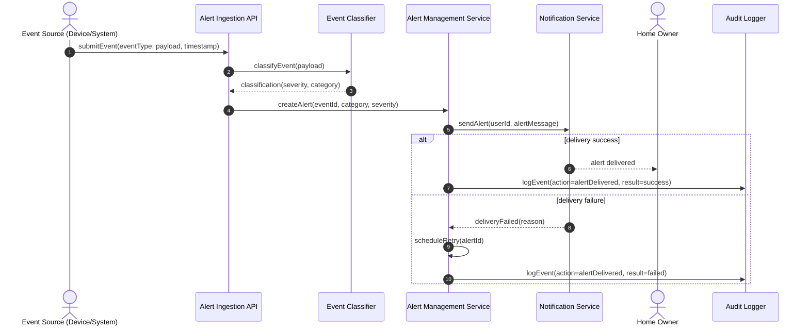

# Alert Flow Interaction Diagram

This interaction diagram details the end-to-end alert pipeline from event ingestion to user delivery and audit recording.

```mermaid
sequenceDiagram
autonumber
actor Source as Event Source (Device/System)
participant Ingest as Alert Ingestion API
participant Classifier as Event Classifier
participant AlertMgr as Alert Management Service
participant Notifier as Notification Service
actor User as Home Owner
participant Audit as Audit Logger

Source->>Ingest: submitEvent(eventType, payload, timestamp)
Ingest->>Classifier: classifyEvent(payload)
Classifier-->>Ingest: classification(severity, category)
Ingest->>AlertMgr: createAlert(eventId, category, severity)
AlertMgr->>Notifier: sendAlert(userId, alertMessage)

alt delivery success
	Notifier-->>User: alert delivered
	AlertMgr->>Audit: logEvent(action=alertDelivered, result=success)
else delivery failure
	Notifier-->>AlertMgr: deliveryFailed(reason)
	AlertMgr->>AlertMgr: scheduleRetry(alertId)
	AlertMgr->>Audit: logEvent(action=alertDelivered, result=failed)
end
```